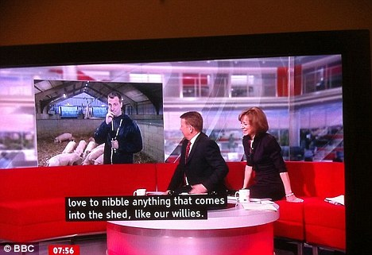

# bbsub

bbsub is a wrapper to the [get_iplayer](http://www.infradead.org/get_iplayer/html/get_iplayer.html) tool, mainly aimed at downloading the programmes' subtitles and playing with [_corpus linguistics_](http://en.wikipedia.org/wiki/Corpus_linguistics). 

## Where do the subtitles come from?

[get_iplayer](http://www.infradead.org/get_iplayer/html/get_iplayer.html) is an open source BBC iPlayer client. Among its many features - some of which are controversial, such as the capability to download to keep the programmes - get_iplayer can download the programmes' subtitles when available, in [srt format](http://en.wikipedia.org/wiki/.srt#SubRip_text_file_format). 

## Usage

First search what programmes you are interested in by using get_iplayer, e.g.

	$ get_iplayer "have i got news for you"
	get_iplayer 2.85.0.0, Copyright (C) 2008-2010 Phil Lewis
	  This program comes with ABSOLUTELY NO WARRANTY; for details use --warranty.
	  This is free software, and you are welcome to redistribute it under certain
	  conditions; use --conditions for details.

	Matches:
	373:	Have I Got News for You: Series 46 - Episode 6, BBC One, Comedy,Guidance,Satire,TV, default

	INFO: 1 Matching Programmes
	$ 

... then get the programme's words and word frequency:

	$ node example1.js 373
	{"programme":2,"contains":2,"strong":3,"language":2,"good":9,"evening":1,"welcome":3,"news":8,"alexander":2,"armstrong":1, ... }

Alternatively, you could directly do:

	$ node example1.js "have i got news for you"
	{"programme":2,"contains":2,"strong":3,"language":2,"good":9,"evening":1,"welcome":3,"news":8,"alexander":2,"armstrong":1, ... }

If the result of the search is more than one programme, the returned corpus will be merged across all programmes, e.g.: 

	$ node example1.js "Inspector Montalbano" 

will give you the corpus of all the episodes listed below:

	$ get_iplayer "Inspector Montalbano"
	get_iplayer 2.85.0.0, Copyright (C) 2008-2010 Phil Lewis
	  This program comes with ABSOLUTELY NO WARRANTY; for details use --warranty.
	  This is free software, and you are welcome to redistribute it under certain
	  conditions; use --conditions for details.

	Matches:
	446:	Inspector Montalbano: Series 3 - 1. Angelica's Smile, BBC Four, Crime,Drama,Guidance,TV, default
	447:	Inspector Montalbano: Series 3 - 2. Hall of Mirrors, BBC Four, Crime,Drama,Guidance,TV, default
	448:	Inspector Montalbano: Series 3 - 3. A Voice in the Night, BBC Four, Crime,Drama,Guidance,TV, default
	449:	Inspector Montalbano: Series 3 - 4. A Ray of Light, BBC Four, Crime,Drama,Guidance,TV, default

Run example.js without parameters to see which search options of the original get_iplayer are supported.

The library offers also additional functionality, such as the extraction of the time code for each occurrence of the words. See the code for more detail. An example is provided with the source:

	$ node example2.js "have i got news for you"
	Analysing 'Have I Got News for You: Series 46: Episode 6'
	The top ten words are:
	  1: said (32 occurrences at 00:01:52,000, 00:02:56,000, 00:05:20,000, ...)
	  2: right (21 occurrences at 00:02:38,000, 00:02:46,000, 00:03:03,000, ...)
	  3: just (20 occurrences at 00:03:53,000, 00:04:30,000, 00:04:37,000, ...)
	  4: know (18 occurrences at 00:02:14,000, 00:02:27,000, 00:02:46,000, ...)
	  5: going (17 occurrences at 00:07:11,000, 00:11:24,000, 00:13:05,000, ...)
	  6: people (15 occurrences at 00:02:14,000, 00:02:38,000, 00:02:56,000, ...)
	  7: think (14 occurrences at 00:02:33,000, 00:04:41,000, 00:06:06,000, ...)
	  8: fire (13 occurrences at 00:23:58,000, 00:24:02,000, 00:24:41,000, ...)
	  9: godfrey (13 occurrences at 00:01:41,000, 00:01:57,000, 00:02:09,000, ...)
	  10: week (13 occurrences at 00:00:45,000, 00:02:09,000, 00:03:08,000, ...)

## Notes
Words shorter than three characters and included in a pre-defined set of stopwords are ignored. The list of stopwords is sourced from [package 'tm'](http://cran.r-project.org/web/packages/tm/index.html) in R. 

Combinations of words that make sense as a whole, e.g. "big data", are unfortunately not recognised. There will be one entry for 'data' and none for 'big', as it is shorter than 4 characters.

The picture is courtesy of [Charlie Swinbourne.com's blog](http://charlieswinbourne.com/2011/10/18/attacking-the-bbc-on-live-subtitles-doesnt-do-deaf-people-any-favours/).